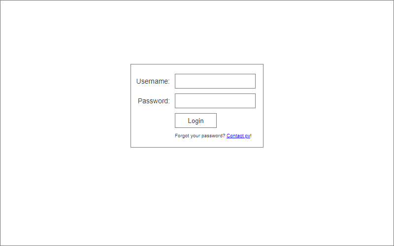
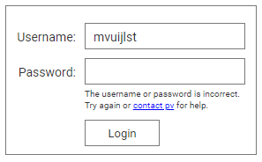

include::00_header.adoc[]

= Management interface

The Provocation Engine has a password-protected management interface. 

The management interface consists of three pages: the login page, the messages page and the feedback page. 

== Login page 

When non-authenticated users attempts to visit any management interface page, they are shown the login page. 

=== Conceptual design

.Provocation Engine management interface: login page for unauthenticated users

The login page contains a form with the following elements:

* *Username*: a plain text field to enter a username
* *Password*: a password field to enter a password
* *Action button*: a button with the label _Login_ to submit the form. The button is _disabled_ as long as either the _username_ or _password_ fields are empty.

When the users enters an incorrect name and/or password, the login page advises the user she has done so with an *error message* between the _password_ field and the _action button_. The name that was entered remains in the field; the password field is emptied. 

.Login: error message

