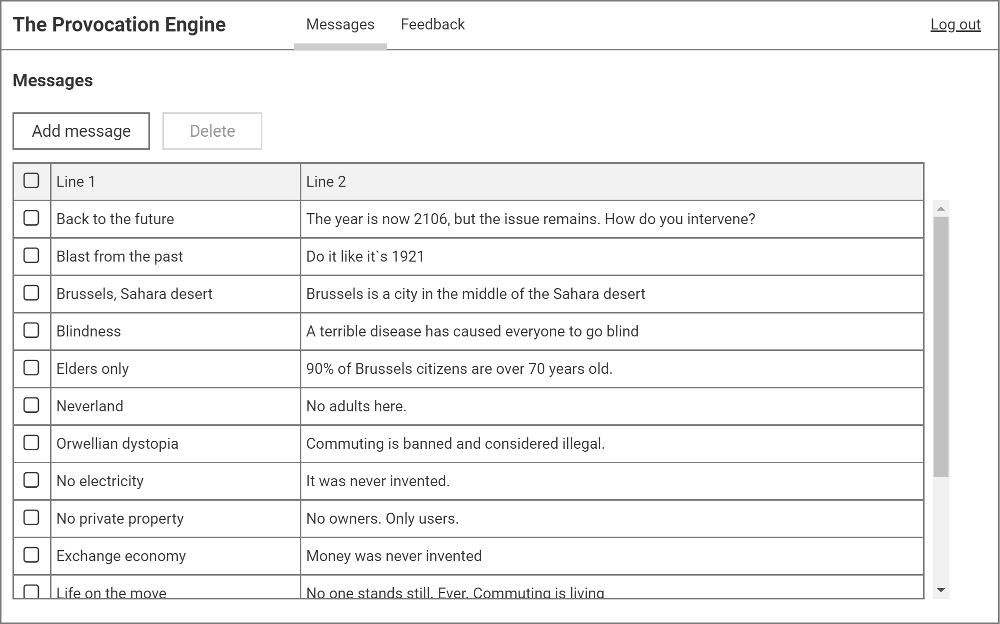
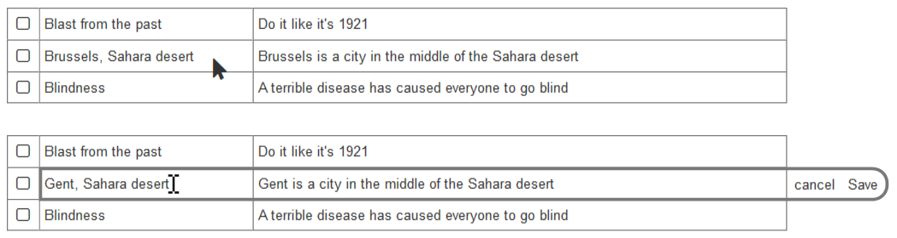
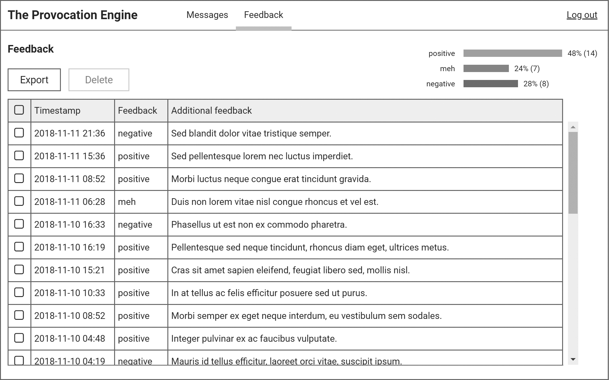

include::00_header.adoc[]

= Management interface

The Provocation Engine has a password-protected management interface. 

The management interface consists of three pages: the login page, the messages page and the feedback page. 

== Login page 

When non-authenticated users attempts to visit any management interface page, they are shown the login page. 

.Provocation Engine management interface: login page for unauthenticated users
image::images/login-concept.png[{wide}]

The login page contains a form with the following elements:

* *Username*: a plain text field to enter a username
* *Password*: a password field to enter a password
* *Action button*: a button with the label _Login_ to submit the form. The button is _disabled_ as long as either the _username_ or _password_ fields are empty.

When the users enters an incorrect name and/or password, the login page advises the user she has done so with an *error message* between the _password_ field and the _action button_. The name that was entered remains in the field; the password field is emptied. 

.Login: error message
image::images/login-error-concept.png[{half-width}]

== Messages page

=== Conceptual design 

The messages page allows an authenticated user to create new messages, and edit and delete existing messages. A message consist of two lines of plain text. The first line is no longer than 40 characters; the second line is no longer than 100 characters.

.Message page

The messages page consists of:

* a *<<components.adoc#mainmenu,main menu>>*
* a *page title*, "Messages"
* a *<<components.adoc#table, table>>* showing all messages, with two **action button**s, "Add message" and "Delete"

==== Messages table

The table contains the following columns:

* *Selection column*: contains a check box for every row, allowing the user to select or deselect that row. The selection column header also contains a checkbox to select or deselect all rows in the table at once.

* *Line 1*: contains the first line of the message.

* *Line 2*: contains the second line of the message.

==== Creating, editing and deleting messages

To *create a new message*, the user clicks the *Create message* primary action button. A <<components.adoc#modalwindow,modal window>> opens, which contains the following:

* a *window header*, containing:
** a *window title*, "New message"
** a *Cancel* action link. Clicking the _Cancel_ action link closes the modal window without warning.
** a *Save* primary action button. The _Save_ primary action button is disabled by default. The _Save_ primary action button becomes enabled when both the _Line 1_ and _Line 2_ fields contain at least one character. Clicking the _Save_ primary action button saves the message and closes the modal window.
* two plain text *form fields*:
** *Line 1*: the first line of the new message, at most 40 characters long.
** *Line 2*: the second line of the new message, at most 100 characters long.

To *edit a message*, the user clicks the text in a row (either Line 1 or Line 2). The row is then outlined and _cancel_ and _Save_ links are added to the row. Both Line 1 and Line 2 for that row can  be edited in place. To cancel the edit and revert to what the row was before editing, the user clicks the _cancel_ link. To save the edit, the user can either click the _Save_ link, or click anywhere outside Line 1 and Line 2.

.In-place editing of a message. Top: table row before editing. Bottom: table rown while editing.

To *delete one or more messages*, the user selects one or more rows in the messages table and clicks the *Delete* action button. The _Delete_ action button is only enabled if at least one row is selected. When clicking the _Delete_ action button, the user gets a <<components.adoc#warning, warning>> to confirm the deletion: "Are you sure you want to delete [number of selected messages] messages?"

== Feedback page

=== Conceptual design 

The feedback page allows an authenticated user to vieew collected feedback, and export and delete feedback items. A feedback item consists of a timestamp, feedback (positive, meh or negative), and optional additional plain text feedback. 

.Feedback page

The feedback page consists of:

* a *<<components.adoc#mainmenu,main menu>>*
* a *page title*, "Feedback"
* a *<<components.adoc#barchart, bar chart>>* showing the total feedback at a glance
* a *<<components.adoc#table, table>>* showing all feedback, with two **action button**s, "Export" and "Delete"

==== Feedback table

The table contains the following columns:

* *Selection column*: contains a check box for every row, allowing the user to select or deselect that row. The selection column header also contains a checkbox to select or deselect all rows in the table at once.

* *Timestamp*: contains the timestamp (date and time) of the feedback.

* *Feedback*: contains the feedback (positive, meh or negative)

* *Additional feedback*: contains optional additional feedback.

==== Exporting and deleting feedback

To *export feedback*, the user clicks selects zero, one or more rows in the table, and clicks the the *Export* primary action button. The user is then prompted to save an Excel version of the selected rows; if no rows are selected, all rows are exported.

To *delete one or more rows*, the user selects one or more rows in the feedback table and clicks the *Delete* action button. The _Delete_ action button is only enabled if at least one row is selected. When clicking the _Delete_ action button, the user gets a <<components.adoc#warning, warning>> to confirm the deletion: "Are you sure you want to delete [number of selected feedback items] feedback items?"