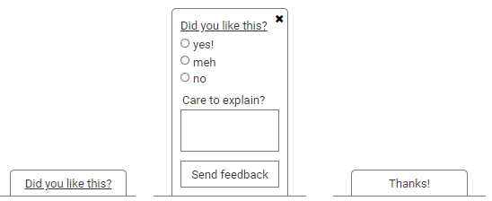
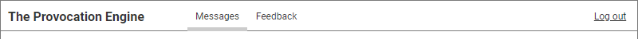
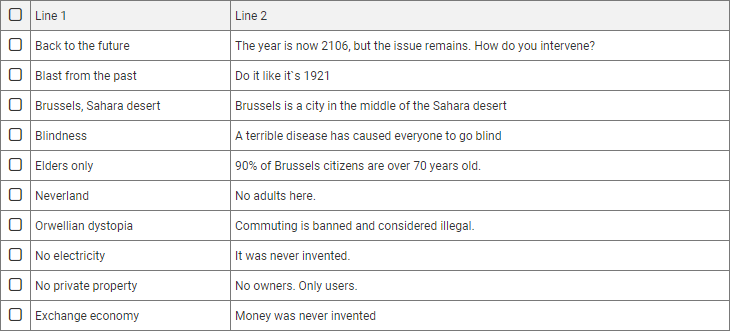
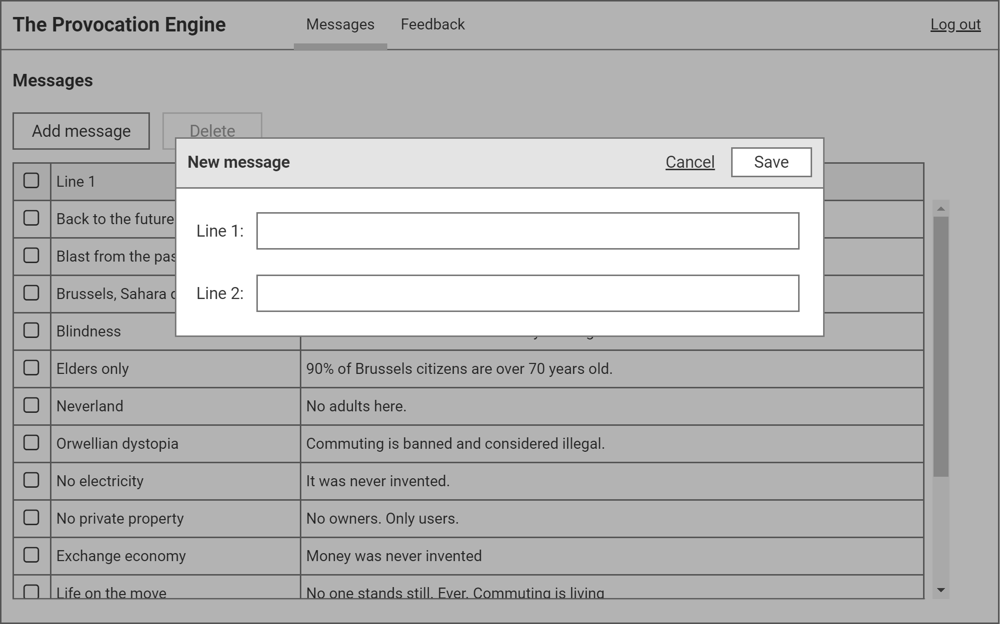

include::00_header.adoc[]

= Components

[[inpage]]
== In-page feedback

The in-page feedback form allows users to give feedback about the page they are currently on. The feedback can be simple (positive / meh / negative), and optionally more extensive. 

=== Conceptual design

.In-page feedback component. Left: default closed state. Middle: open state. Right: final state, after having sent feedback. 

The in-page feedback component has three states:

* *Closed state*: an action button, which when selected shows the _open state_ of the in-page feedback component.

* *Open state*: a feedback form, containing the following elements:
** *Feedback options*: a radio button group with three options (positive / meh / negative). 
** *Detailed feedback*: a multi-line text field where users can enter more detailed feedback.
** *Action button*: a button to submit the feedback form. When clicked, the _final state_ of the in-page feedback component is shown.
** *Close button*: a button to close the feedback form, possibly without sending feedback. When clicked, the _closed state_ of the in-page feedback component is shown.

* *Final state*: a label, thanking the user for their feedback.

=== Behaviour

Only the last selected _feedback option_ in any give session is permanently stored in the application, i.e. when a user selects the "positive" feedback option, then changes her ming and selects the "meh" feedback option and even later the "negative" feedback option in the same session, only the "negative" option is recorded. 

When the user selects one of the three __feedback option__s and then selects the _close button_, a subsequent selection of the action button on the _closed state_ will show the _open state_ with the previously selected _feedback option_ selected.

[[mainmenu]]
== Main menu

The main menu appears once a user is authenticated. It contains navigation items and a way to log out.

=== Conceptual design

.Main menu

It's pretty straightforward, yo. 

[[table]]
== Table

A table is used to show tabular data. 

=== Conceptual design

.Table

A table has rows and columns. There may be a header row too. 

[[modalpopup]]
== Modal pop-up window

A modal pop-up window appears in a lightbox etc. 

=== Conceptual design

.Modal pop-up window

It's modal. 

