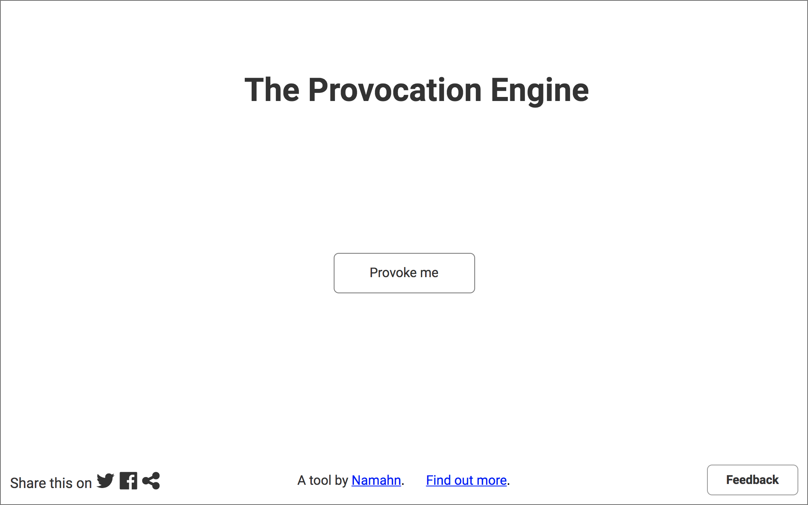

include::00_header.adoc[]

= Public-facing home page

== Conceptual design

The public-facing home page is available to all users. No login is necessary. 

.Public-facing home page of the Provocation Engine

The public-facing home page contains the following elements:

* *Page title*: tells users they are visiting the Provocation Engine. The page title could be text and/or a logo.
* *Provocation message*: a two-line message. When the user first visits the public-facing home page, no provocation message is shown. 
* *Action button*: a button with the label _Provoke me_. Clicking the action button shows a random provocation message from a list of messages. Each subsequent click of the action hutton shows a different random message. When all messages have been shown the action button is hidden and the message "You have been provoked enough. Try your luck elsewhere." is shown.
* *Namahn link*: indicates that the Provocation Engine is "Powered by Namahn".
* *Feedback*: an <<components.adoc#inpage,in-page feedback>> component.
* *Share buttons*: a number of buttons to share the Provocation Engine public-facing home page on social media. 

WARNING: need to find out what channels to share to -- Twitter, Facebook, LinkedIn?, other?

* *Find out more*: a link to show an _information overlay_ explaining the theory behind the Provocation Engine and how to use it. 

.Public-facing home page, overlay with more information.

The *information overlay* contains:

* *Text* to be provided
* *Links* to places to follow Namahn / Provocation Engine on social media.